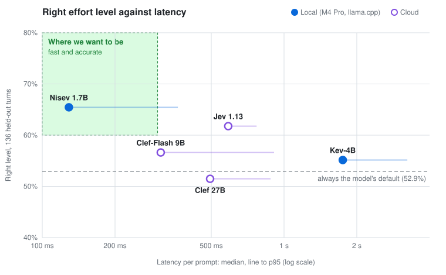

# auto-effort

A Claude Code [mod](https://code.claude.com/docs/en/plugins/mods/overview) that picks
Claude's effort level for each prompt, using a System One decision model such as
[Jev](https://typesafe.ai/blog/introducing-system-one-models-and-jev). It raises effort for
work that needs it, lowers it for quick edits, and otherwise leaves the model's default
alone.

Tested with Claude Code v2.1.287.

## Install

The repository is its own plugin marketplace:

```sh
claude plugin marketplace add arthur-fontaine/cc-mod-auto-effort
claude plugin install auto-effort@auto-effort-dev
```

Then start a new session (or run `/reload-plugins`) and
[choose a provider](#choose-a-provider) with `/auto-effort setup`.

Inside a session, `/plugin` does the same: add the marketplace
`arthur-fontaine/cc-mod-auto-effort`, then install `auto-effort`.

To try it without installing, load a checkout for one session; it reloads when you save a
file:

```sh
git clone https://github.com/arthur-fontaine/cc-mod-auto-effort
claude --plugin-dir ./cc-mod-auto-effort
```

<details>
<summary>Enable it for one repository only</summary>

Add this to the repository's `.claude/settings.local.json`, and make sure that file is
gitignored. Use `.claude/settings.json` to share it with everyone in the repository, but
keep the key out of that file.

```json
{
  "extraKnownMarketplaces": {
    "auto-effort-dev": { "source": { "source": "github", "repo": "arthur-fontaine/cc-mod-auto-effort" } }
  },
  "enabledPlugins": { "auto-effort@auto-effort-dev": true }
}
```

To develop against a checkout, use `{ "source": "directory", "path": "/path/to/cc-mod-auto-effort" }`
as the source: edits apply after `/reload-plugins`. Claude Code honors these entries only
once you trust the folder.

</details>

## Choose a provider

The mod asks a decision model how much effort each prompt needs. Run `/auto-effort setup`
to pick one; there's no default, so the mod calls nothing until you do. Your choice is saved
across sessions.

- **Nisev** is our own model, made for this one question: a Qwen3-1.7B fine-tuned on about
  2,400 prompts from real coding-agent sessions, labeled by Claude. It runs on your machine
  through llama.cpp, so prompts never leave it. See [how it was built](training/README.md).
- **Jev** (by TypeSafe) and **Clef** (by Cloudflare) are general decision models, served in
  the cloud. They answer the mod's question without training for it.

| Model | Runs | Right level | Latency, median | You need |
| :- | :- | -: | -: | :- |
| Nisev 1.7B | On your machine | 65.4% | 129 ms | llama.cpp, and a one-time 1.9 GB download |
| Jev 1.13 | Cloud | 61.8% | 588 ms | An API key from a provider that serves it |
| Clef-Flash 9B, Clef 27B | Cloud | 56.6%, 51.5% | 309, 495 ms | An API key from a provider that serves it |

"Right level" is how often the model picked the effort that two Claude teachers agreed on,
over 136 real turns; always keeping the default gets 51.5%. Latency is from an M4 Pro; for
cloud models it depends on the provider. Details in the [benchmark](#benchmark).

### Nisev (local)

- **Needs** llama.cpp build b11361 or later, as `llama-server` or the unified `llama` CLI.
  Get it from [its releases](https://github.com/ggml-org/llama.cpp/releases) or a package
  manager.
- **First start**: setup asks before downloading. llama.cpp then fetches the model and
  caches it, which takes about 3 minutes on a fast connection. Prompts keep the session's
  effort until the status line says Nisev is ready.
- **While it runs**: the mod serves it on `127.0.0.1:8765` for the session, using about
  2 GB of memory, and stops it with the session.
- **Privacy**: nothing leaves your machine, apart from that one-time download.

### A cloud model (Jev, Clef)

Any provider that serves the System One API works. Setup has **OpenCode Zen** and
**TypeSafe** built in; for any other, choose **Other** and enter its endpoint and model.
Then set the provider's key as `AUTO_EFFORT_API_KEY` ([where](#environment-variables)).
The mod never stores it.

Some providers that work:

| Provider | Endpoint | Model |
| :- | :- | :- |
| OpenCode Zen | `https://opencode.ai/zen/v1/systemone` | `jev-1.13` |
| TypeSafe | `https://api.typesafe.ai/v1/systemone` | `jev-latest` |
| OpenRouter | `https://openrouter.ai/api/v1/systemone` | `typesafe/jev-1.13` |
| Cloudflare Workers AI | see below | `clef` or `clef-flash` |

<details>
<summary>Get an OpenCode API key</summary>

1. Sign in at <https://opencode.ai/auth> and open your workspace.
2. Open **Keys**, which lists service accounts, and click **Add Service Account**. Name it,
   for example `cc-mod-auto-effort`.
3. On the service account, click **Add API Key** and set **Permissions** to
   **Inference only**. The expiry date is optional.
4. Copy the key, since it is shown once, and set it as `AUTO_EFFORT_API_KEY`.

</details>

<details>
<summary>Use Clef on Cloudflare Workers AI</summary>

1. In the [Cloudflare dashboard](https://dash.cloudflare.com/profile/api-tokens), open
   **My Profile** > **API Tokens** and click **Create Token**.
2. Use the **Workers AI** template. Set a **TTL** if you want the token to expire.
3. Copy the token, since it is shown once, and set it as `AUTO_EFFORT_API_KEY`.
4. Find your account ID in the dashboard's URL: `dash.cloudflare.com/<account id>/…`.
5. In `/auto-effort setup`, choose **Other**, enter this URL, then `clef` or `clef-flash`
   as the model, matching the end of the URL:

   ```
   https://api.cloudflare.com/client/v4/accounts/<account id>/ai/run/@cf/cloudflare/clef
   ```

</details>

A decision model you run yourself works the same way. For example, start
`llama-server -hf ggml-org/Kev-4B-GGUF:Q8_0 --port 8080` and choose **Other** with
`http://127.0.0.1:8080/v1/systemone`.

**Privacy**: each prompt goes to the endpoint, truncated to 6,000 characters, with up to
1,500 characters of Claude's previous reply and the session's model name. Set
`AUTO_EFFORT_INCLUDE_CONTEXT=false` to send the prompt alone. Your provider's data policy
applies; OpenCode says Jev inputs aren't used for training.

## Commands

| Command | What it does |
| :- | :- |
| `/auto-effort` | Shows the provider, what's missing, Nisev's state, and the last decision. |
| `/auto-effort setup` | Chooses the provider. |
| `/auto-effort off` / `on` | Stops or resumes the overrides. Saved across sessions. |

## Environment variables

Variables take precedence over what setup saved, so you can also configure the mod with them
alone. Set them in your shell before starting `claude`, or in the `env` block of
`~/.claude/settings.json` (every session) or a repository's `.claude/settings.local.json`.
Never put the key in a settings file that's committed.

```json
{
  "env": {
    "AUTO_EFFORT_ENDPOINT": "https://opencode.ai/zen/v1/systemone",
    "AUTO_EFFORT_API_KEY": "oc_…",
    "AUTO_EFFORT_MODEL": "jev-1.13"
  }
}
```

The mod reads them on each prompt; after editing a settings file, start a new session or
run `/reload-plugins`.

**Provider**

| Variable | With a cloud endpoint | With Nisev |
| :- | :- | :- |
| `AUTO_EFFORT_PROVIDER` | `jev`, for any System One endpoint (Jev, Clef…). Implied by `AUTO_EFFORT_ENDPOINT`. | `nisev` |
| `AUTO_EFFORT_ENDPOINT` | The System One URL. Use `https://`: the key is sent as a bearer token. | The local URL to serve it at. Defaults to `http://127.0.0.1:8765/v1/systemone`; if Nisev already answers there, the mod uses that server. |
| `AUTO_EFFORT_MODEL` | The model name the endpoint expects. | The model llama.cpp serves: a Hugging Face `repo:quant` or a `.gguf` path. Defaults to `arthur-fontaine/nisev-1.7b-GGUF:Q8_0`. |
| `AUTO_EFFORT_API_KEY` | The endpoint's key. Only ever read from the environment. | Not used. |
| `AUTO_EFFORT_LLAMA_SERVER` | Not used. | The llama.cpp binary, `llama-server` or `llama`. Defaults to the first on your `PATH`. |

What setup saved applies only to the provider it was saved for. While a cloud endpoint
lacks its endpoint, key or model, the mod changes nothing, and the status line and
`/auto-effort` say what's missing.

**Behavior**

| Variable | Default | What it is |
| :- | :- | :- |
| `AUTO_EFFORT_MIN_CONFIDENCE` | `0.5` | Below this confidence, from 0 to 1, the session's effort stands. |
| `AUTO_EFFORT_TIMEOUT_MS` | `4000` | How long to wait for the provider. |
| `AUTO_EFFORT_MIN_EFFORT` / `_MAX_EFFORT` | `low` / `xhigh` | The levels the mod may pick, from `low`, `medium`, `high`, `xhigh`, `max`. |
| `AUTO_EFFORT_INCLUDE_CONTEXT` | `true` | `false` sends the prompt without Claude's previous reply. |

## How it decides

[Anthropic's guidance](https://claude.com/blog/claude-model-and-effort-level-in-claude-code)
is that the model's default effort is right for most tasks, so effort should change only
for a clear reason. For each prompt, the mod:

1. **Asks the provider** about your prompt, Claude's previous reply (so "yes, do it" makes
   sense), and the session's model. Effort is calibrated per model: Opus 5.5 defaults to
   `medium`, most others to `high`.
   - A cloud model picks one of `low`, `medium`, `default`, `high`, `xhigh` and `max`,
     each described with the blog post's rubric.
   - Nisev sorts the request into one of six kinds of task, from `trivial` to `exhaustive`.
     A table in [`hooks/policy.js`](hooks/policy.js) turns that into a level for the
     session's model.
2. **Applies the pick** to every request of that turn, clamped to
   `AUTO_EFFORT_MIN_EFFORT`–`AUTO_EFFORT_MAX_EFFORT` (`low`–`xhigh` by default).
3. **Shows it** on the status line, for example `effort high · 82%`.

It leaves the session's own effort alone when:

- the pick is the model's default, or its confidence is below `AUTO_EFFORT_MIN_CONFIDENCE`;
- the provider times out or errors, or Nisev is still starting;
- no provider is set up, the model takes no effort, or the request comes from a subagent.

Each prompt waits for the answer before its turn starts: about 130 ms with Nisev on an M4
Pro, 600 ms with Jev through OpenCode Zen, and never more than `AUTO_EFFORT_TIMEOUT_MS`.

## Benchmark



**The test**: 136 held-out turns from 35 real coding sessions. The answer key is the effort
level two Claude teachers, Sonnet 5.5 and Opus 5.5, agreed on after seeing what happened in
the turn. Always keeping the model's default gets 51.5% right.

**The setup**: each model got the request the mod sends it, one at a time. The local models
ran in llama.cpp b11406 on an Apple M4 Pro with 24 GB. Cloud latency includes the round trip
from that Mac. Clef and Clef-Flash ran on Workers AI, since neither is practical on a 24 GB
Mac: Clef-Flash in llama.cpp took 3.4 s per prompt at the median, at 4-bit.

**The green zone** is where a picker should be. Both edges are set by a rule, not read off
the results:

- **Fast**: under 400 ms at the median, the
  [Doherty threshold](https://lawsofux.com/doherty-threshold/), below which people stay
  engaged instead of waiting.
- **Accurate**: at least 59.6%, the lowest score that beats always keeping the default by
  more than chance on these turns (one-sided exact binomial test, p < 0.05), computed by
  [`plot.py`](training/pipeline/plot.py).

| Model | Runs | Right level | Right level on Opus 5.5 | Right level applied | Latency p50 / p95 |
| :- | :- | -: | -: | -: | -: |
| **Nisev 1.7B** | Local · llama.cpp · Q8_0, 1.8 GB | 65.4% | 73.5% | 66.9% | 129 / 364 ms |
| Kev-4B | Local · llama.cpp · Q8_0, 4.5 GB | 55.1% | 60.3% | 52.2% | 1750 / 3236 ms |
| Clef-Flash 9B | Cloud · Cloudflare Workers AI | 56.6% | 64.7% | 51.5% | 309 / 909 ms |
| Clef 27B | Cloud · Cloudflare Workers AI | 51.5% | 65.4% | 51.5% | 495 / 880 ms |
| Jev 1.13 | Cloud · OpenCode Zen | 61.8% | 70.6% | 62.5% | 588 / 770 ms |

- **Right level**: picked the teachers' level, for the Claude model that ran the turn.
- **Right level on Opus 5.5**: the same turns, scored as if they ran on Opus 5.5, whose
  default is `medium`.
- **Right level applied**: what the mod ends up doing. It applies a pick only at a
  confidence of 0.5 or more, and otherwise keeps the session's effort.

What stands out:

- **Only Nisev and Jev beat the default by more than chance**, compared turn by turn
  (one-sided exact McNemar test): Nisev p = 0.009, Jev p = 0.04, Kev 0.18, Clef-Flash 0.21,
  Clef 0.55.
- **Kev and Clef are rarely confident**: 0.5 or more on at most 2 of 136 turns (median 0.12
  to 0.18), so the mod almost never applies their picks. Jev clears it on half the turns.
- **Clef leans to `medium`** (40% of turns), right on Opus 5.5 and a step too low on models
  that default to `high`. It also answers `max` on 12 turns.
- **Read gaps of a few points as noise** at 136 turns. Kev, Clef and Jev answer zero-shot;
  Nisev was trained on this question, from the same kind of sessions.

To rerun it, run `uv run python pipeline/benchmark.py` in [`training/`](training/README.md),
which also explains how Nisev was built.

## Develop

```sh
pnpm test        # claude plugin test: hooks with stubbed providers and processes, no network
pnpm validate    # claude plugin validate --strict
pnpm eval        # sample prompts against the live provider, reading .env
```

- `pnpm eval` needs a cloud endpoint's three variables, in the environment or a gitignored
  `.env` (see `.env.example`), or `AUTO_EFFORT_PROVIDER=nisev` with Nisev already served.
  It reports the session model as `claude-opus-5-5`; set `AUTO_EFFORT_EVAL_CLAUDE_MODEL`
  to try another.
- On 2026-10-03 it matched the expected level on 6 of 9 sample prompts, with both
  `jev-1.13` and Nisev. The Jev run took 0.4–1 s per call and about 7k input tokens
  ($0.0003).
- `claude --plugin-dir . --debug-file /tmp/cc.log` logs each override as
  `[auto-effort] … effort low → high`.
